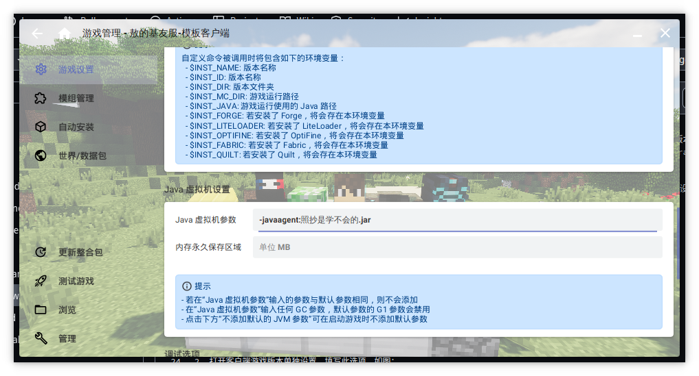

配置 URL 咒语启动，云端配置下发以及配置自更新（可选）

前置动作：

1. 将配置文件、`McPatchClient.jar`、`hmclversion.cfg` 放在 `workspace/` 内，一定要按照您想要的配置修改配置文件。
2. 打包一个新版本，并按照普通更新流程更新。
3. 发布更新。

---

前提条件：

您对客户端打开了版本隔离。
您使用 https、http 任意一个协议共享文件。
您明白且知道如何教会玩家使用在线导入整合包功能。
您很确定您的玩家会使用 hmcl。

---

概念解释：

- 目录 = 文件夹 = 📁
- 根目录：某目录结构的起点。
- 路径：告诉计算机如何找到某目录或文件的一串字符。

### hmcl

1. 首先准备好已正确安装 McPatchClient 的客户端，**需要开启版本隔离**。
2. 打开客户端游戏版本单独设置，填写JVM虚拟机选项，如图：

3. 如您没有将config.yml放置在客户端文件夹，请补上它。
4. 导出整合包，信息可按照您的喜好填写，但您**必须勾选**下列文件，这是咒语能否起效的关键！
+ tips:打开包含启动器后，可以让玩家直接下载整合包并解压，但也失去了在线导入的能力，您可以选择另外导出一份不含启动器的整合包，并一起上传。

这是需要的文件列表：

5. 在存放更新文件的根目录，新建一个目录，上传刚刚导出的整合包。
6. 组装您的在线整合包url，格式为 `http或https://您存放整合包的网站服务器地址:端口/您的更新地址`，例如 `https://download.example.com/somefile/your-package.zip`
7. 在您编写客户端安装教程时告诉玩家使用此 url,hmcl 会完全接管安装。